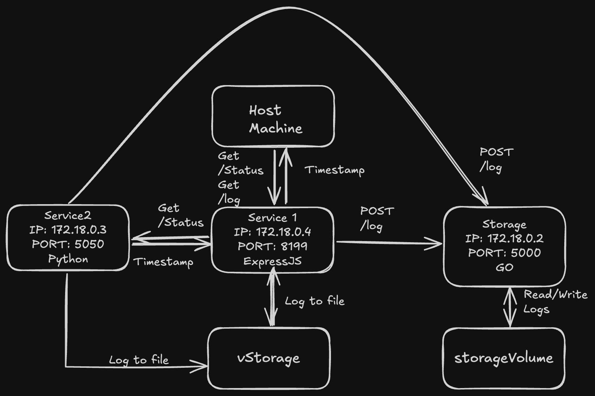

# DevOps - Exercise 1 Report

This repository contains a simple system with three services, implemented in **three different technologies**
(Node.js, Python, and Go), that communicate with each other and use two different persistent storage solutions (a bind mount and a named volume).

## Platform Information

- **Hardware:** Macbook 
- **OS:** MacOS 26
- **Docker** ≥ 20.x
- **Docker Compose** ≥ 3.x
- Git

## System Architecture



- **Service1** – Node.js (Express)

  - The **only service accessible from outside**.
  - Collects system uptime and free disk space.
  - Stores logs in:
    - Shared file volume `vstorage`
    - Storage service
  - Forwards requests to **Service2**.
  - Combines status from Service1 and Service2 and returns.
  - Endpoints:
    - `GET /status` → Analyze uptime, space, and append new log entry (`text/plain`)
    - `GET /log` → Retrieve all logs (`text/plain`)

- **Service2** – Python (FastAPI)

  - Collects system uptime and free disk space.
  - Stores logs in:
    - Shared file volume `vstorage`
    - Storage service
  - Returns status info back to Service1.
  - Endpoints:
    - `GET /status` → Analyze uptime, space, and append new log entry (`text/plain`)

- **Storage** – Go (HTTP Server)

  - Simple REST API for persistent logs.
  - `storageVolume`: a named Docker volume mounted only into Storage at `/storage` and used to persist its internal `logs.txt`.
  - Persists logs between container restarts using Docker volumes.
  - Endpoints:
    - `POST /log` → Append new log entry (`text/plain`)
    - `GET /log` → Retrieve all logs (`text/plain`)

- **vstorage** – Host file `./vstorage` mounted into Service1 and Service2 at `/vStorage` and appended per request. This is the simple shared file method.

- **Networking**
  - A single user-defined `my_network` network connects all three services. Only Service1 publishes a host port.

## Analysis of Status Records

- **Timestamp:** Used ISO 8601 UTC `2025-09-28T10:04:30Z` format as required

- **Uptime:** The uptime of both services is reported in two decimal places in hours.

- **Disk Space:**
  - Service1: Reads free space from Root filesystem in MB using `df -k /` Shell command in Nodejs `child_process.exec`
  - Service2: Reads free disk space from Root filesystem in MB using shutil library

### Relevance of Measurements

1. **Uptime:**

   - **Relevance:** Uptime is a useful metric for understanding how long the service has been running without interruption. It can help identify stability issues or frequent restarts.
   - **Limitations:** Uptime alone does not provide insights into the health of the service, such as performance, resource usage, or error rates. It is only a basic indicator of availability.

2. **Disk Space:**
   - **Relevance:** Monitoring free disk space is critical for ensuring the application has enough storage to operate without failures. If the disk becomes full, the service may fail to write logs or other critical data, leading to potential downtime or data loss.
   - **Limitations:**
     - The measurement is limited to the root filesystem (`/`) and does not account for other mounted filesystems or specific storage volumes used by the application.
     - It provides a snapshot of the disk space at the time of the request but does not track trends over time.

### What Should Be Done Better

1. **Uptime:**

   - **Enhance Monitoring:** Instead of just reporting uptime, include additional metrics such as CPU usage, memory usage, and request error rates to provide a more comprehensive view of the service's health.
   - **Track Restarts:** Log the number of restarts or crashes to identify potential stability issues.

2. **Disk Space:**
   - **Monitor Specific Volumes:** If the application uses specific volumes (e.g., `/vStorage`), monitor the free space on those volumes instead of just the root filesystem.
   - **Set Alerts:** Implement thresholds and alerts for low disk space to proactively address storage issues before they impact the service.
   - **Track Trends:** Record disk space usage over time to identify patterns and predict when storage might become a problem.

By enhancing these measurements and adding more context, the monitoring system can provide better insights into the application's health and stability.

## Analysis of Persistent Storage Solutions

The project uses two types of persistent storage: a bind mount (`vstorage`) and a named volume (`storageVolume`).

### Bind Mount (`vstorage`)

- **Good:**
  - **Easy to use:** Bind mounts are easy to set up and use. They directly map a host directory to a container directory.
  - **Direct access:** The files are stored on the host machine, making them easily accessible for inspection and modification without going through the Docker volume commands.
- **Bad:**
  - **Platform dependent:** The path to the host directory is platform-dependent, which can cause issues when moving the project to a different machine or operating system.
  - **Less portable:** The data is tightly coupled with the host machine's file system.

### Named Volume (`storageVolume`)

- **Good:**
  - **Managed by Docker:** Named volumes are managed by Docker, making them platform-independent and more portable.
  - **Decoupled from host:** The data is stored in a dedicated location within the Docker directory, which decouples it from the host's file system structure.
  - **Easier to back up and migrate:** Docker provides commands to easily back up, restore, and migrate named volumes.
- **Bad:**
  - **Less direct access:** Accessing the data directly requires using Docker commands or knowing the specific location on the host where Docker stores the volumes.

## How to Run

1. Clone the repository using the command:
   ```bash
   git clone -b exercise1 https://github.com/Rohanjai/DevOps-Course.git
   ```
2. Navigate to the project directory:
   ```bash
   cd DevOps-Course
   ```
3. Build and start the services:
   ```bash
   docker-compose up --build -d
   ```
4. Wait ~10 seconds for the services to initialize.
5. Test the status flow:
   ```bash
   curl localhost:8199/status
   ```
6. Fetch the first storage log:
   ```bash
   curl localhost:8199/log
   ```
7. Fetch the second storage log:
   ```bash
   cat ./vstorage
   ```
8. Stop the services:
   ```bash
   docker-compose down
   ```

## Instruction for Cleaning Up the Persistent Storage

To clean up the persistent storage, you need to remove the Docker volumes and the bind-mounted directory.

1.  **Stop and remove the containers:**
    ```bash
    docker-compose down
    ```
2.  **Remove the named volume:**
    ```bash
    docker volume rm devops-course_storageVolume
    ```
3.  **Remove the bind-mounted directory:**
    ```bash
    rm -rf ./vstorage
    ```

## What was difficult?

1. **Service Communication:**
   - Ensuring reliable communication between services (e.g., `Service1`, `Service2`, and `Storage`) was challenging, especially when dealing with network delays or timeouts.
   - Debugging issues related to inter-service communication required careful inspection of logs and network configurations.

## What were the main problems?

1. **Network Configuration:**

   - Misconfigurations in the Docker network (e.g., incorrect service names or ports) caused initial failures in inter-service communication.

2. **Timeouts and Latency:**

   - The default timeout for service requests was sometimes too short, leading to unnecessary failures when services were slow to respond.

3. **Disk Space Monitoring:**

   - The disk space monitoring was limited to the root filesystem (`/`) and did not account for specific volumes like `/vStorage`, which could lead to incomplete insights.

4. **Log Management:**

   - Writing logs to both the local volume and the storage service introduced redundancy and potential inconsistencies.
   - Ensuring logs were properly synchronized between the two storage locations was a challenge.

5. **Error Propagation:**

   - Errors in one service (e.g., `Service2` being unavailable) often propagated to other services, leading to cascading failures.

6. **Cleanup of Persistent Storage:**
   - Cleaning up bind mounts and named volumes after testing was not straightforward, leading to leftover data and potential conflicts in subsequent runs.
